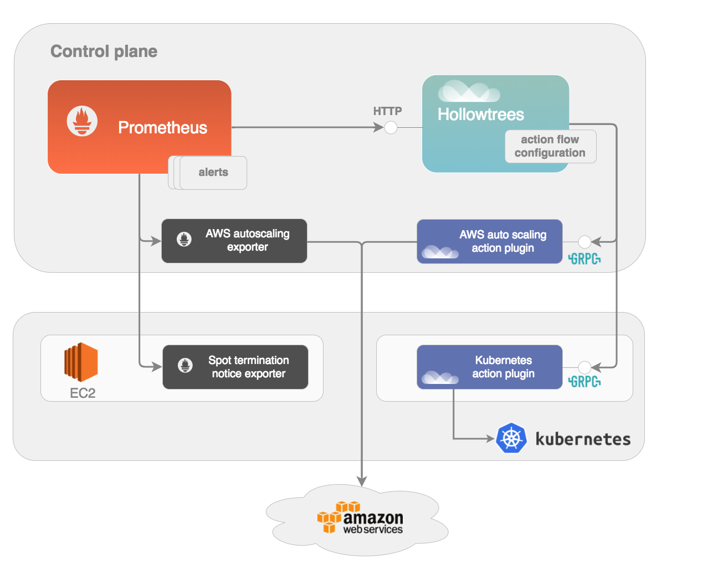

_Hollowtrees is a wave for the highest level, the pin-up centrefold for the Mentawai islands bringing a new machine-like level to the word perfection. Watch out for the vigilant guardian aptly named The Surgeons Table, whose sole purpose is to take parts of you as a trophy._

_Hollowtrees, a ruleset based watchguard is keeping spot instance based clusters safe and allows to use them in production.
Handles spot price surges within one region or availability zone and reschedules applications before instances are taking down. Hollowtrees follows the "batteries included but removable" principle and has plugins for different runtimes and frameworks. At the lowest level it manages spot based clusters of virtual machines, however it contains plugins for Kubernetes, Prometheus and Pipeline as well._

<p align="center">
  
</p>

**Warning:** _Hollowtrees is experimental, under development and does not have a stable release yet. If in doubt, don't go out._

### Quick start

Building the project is as simple as running a go build command. The result is a statically linked executable binary.
```
go build .
./hollowtrees
```

Configuration of the project is done through a YAML config file. An example for that can be found under conf/config.yaml.example

### Quick architecture overview

>For an introduction and overview of the architecture please read the following blog [post](https://banzaicloud.com/blog/hollowtrees)




### Configuring Prometheus to send alerts to Hollowtrees

Hollowtrees is listening on an API similar to the [Prometheus Alert Manager](https://prometheus.io/docs/alerting/alertmanager/) and it can be configured in Prometheus as an Alert Manager. For example if Hollowtrees is running locally on port 9092 (configurable through `global.bindAddr`), Prometheus can be configured like this to send its alerts to Hollowtrees directly:

```
# Alertmanager configuration
alerting:
  alertmanagers:
  - static_configs:
    - targets:
       - localhost:9092

```

#### Batteries included 

There are a few default Hollowtrees node exporters associated to alerts:

* AWS spot instance termination [collector](https://github.com/banzaicloud/spot-termination-collector)
* AWS autoscaling group [exporter](https://github.com/banzaicloud/aws-autoscaling-exporter)

### Configuring action flows

After a Prometheus alert is received by Hollowtrees, it first converts it to an event that complies to the [OpenEvents](https://openevents.io) specification, then it processes it based on the action flows configured in the `config.yaml` file, and sends events to its configured action plugins. An example configuration can be found in `conf/config.yaml.example` under `action_plugin` and `action flows`.

Hollowtrees uses gRPC to send events to its action plugins, and calls the action plugins sequentially. This very simple rule engine will probably change once Hollowtrees will have a release and will support different calling mechanisms, and passing of configuration parameters to the plugins.

Alerts coming from Prometheus are converted to events with an event_type of `prometheus.server.alert.<AlertName>`. Prometheus labels are converted to the `data` payload. Data payload elements can be used in the action flows to forward events to the plugins only when it matches a specific string.

#### Advanced control structures in action flows

* `concurrent_flows`: number of allowed concurrent action flows running of the same *event type* (e.g.: if an alert is firing for a large number of instances at the same time, but we shouldn't touch all these instances in the cluster at once)
* `flow_cooldown`: Cooldown time that passes after an action flow is successfully finished. Use it in conjunction with the concurrency limits - during the cooldown the action flow is considered `in progress`. Format: golang time, e.g.: `5m30s`
* `group_by`: Categorizes subsequent events as the same, if all the corresponding values of these attributes match. Use it with the below 2 properties. (e.g.: alerts coming in with the same `instance_id` attribute for a specific event type can be considered the *same*)
* `repeat_cooldown`: Cooldown time that must pass before an action flow can be repeated for the *same* event. Format: golang time, e.g.: `1h30m`
* `retries`: Number of retries if an action flow fails for a specific event.

#### Batteries included 

There are a few default Hollowtrees action flows available:

* AWS Spot Cluster [recommender](https://github.com/banzaicloud/cluster-recommender)

### Action plugins

Action plugins are microservices that can react to different Hollowtrees events. They are listening on a gRPC endpoint and processing events in an arbitrary way. An example action plugin is the [AWS-ASG](https://github.com/banzaicloud/ht-aws-asg-action-plugin) that reacts to specific `spot-instance` related events by swapping a spot instance in an AWS auto scaling group to another one with better cost or stability characteristics.
To create an action plugin, the [actionserver](github.com/banzaicloud/hollowtrees/actionserver) package must be imported, the `AlertHandler` interface must be implemented and the gRPC server must be started with

```
as.Serve(port, newAlertHandler())
```

#### Batteries included 

There are a few default Hollowtrees action plugins available:

* Kubernetes action [plugin](https://github.com/banzaicloud/ht-k8s-action-plugin) to execute k8s operations (e.g. graceful drain)
* AWS autoscaling group [plugin](https://github.com/banzaicloud/ht-aws-asg-action-plugin) to replace instances with a better cost or stability characteristics

### License

Copyright (c) 2017-2018 [Banzai Cloud, Inc.](https://banzaicloud.com)

Licensed under the Apache License, Version 2.0 (the "License");
you may not use this file except in compliance with the License.
You may obtain a copy of the License at

[http://www.apache.org/licenses/LICENSE-2.0](http://www.apache.org/licenses/LICENSE-2.0)

Unless required by applicable law or agreed to in writing, software
distributed under the License is distributed on an "AS IS" BASIS,
WITHOUT WARRANTIES OR CONDITIONS OF ANY KIND, either express or implied.
See the License for the specific language governing permissions and
limitations under the License.
